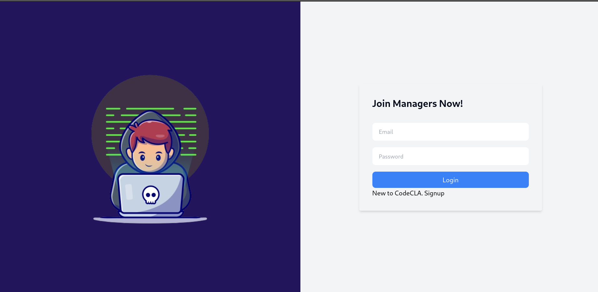
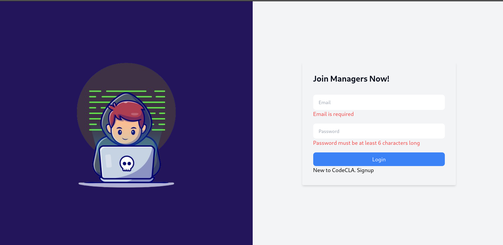
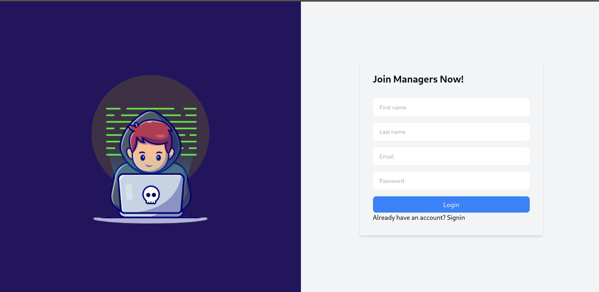
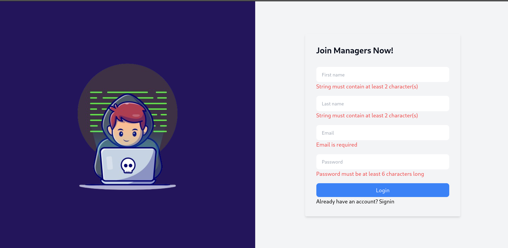

## NextJS assignment
In this assignment, you're going to build the manager dashboard app that provides utilities to create, edit, and delete challenges that will be used by coders. The app will be written in NextJS, and since you did not implement the backend app to manage the challenges (it will be implemented in a later assignment), we are going to use a simple json server that exposes CRUD endpoints for challenges.

But for the authentication, you're going to fully integrate it with the your express backend since it manages authentication.

### Project setup
Before you start, make sure you create a NextJS application and configure it to run on unused port (8080 for example).

Next install [json-server](https://www.npmjs.com/package/json-server). It is a Node.js package that allows you to quickly set up a RESTful API with CRUD (Create, Read, Update, Delete) operations based on a JSON file. Here's the data file that we are going to use:

```json
{
  "challenges": [
    {
      "id": "1",
      "title": "Palindrome Checker",
      "category": "Strings",
      "description": "### Problem Statement:\nWrite a function that checks whether a given string is a palindrome or not. A palindrome is a word, phrase, number, or other sequence of characters that reads the same forward and backward.",
      "level": "Easy",
      "code": {},
      "tests": [],
      "createdAt": "2024-04-02"
    },
    {
      "id": "2",
      "title": "FizzBuzz",
      "category": "Logic",
      "description": "### Problem Statement:\nWrite a program that prints the numbers from 1 to 100. But for multiples of three, print 'Fizz' instead of the number, and for the multiples of five, print 'Buzz'. For numbers that are multiples of both three and five, print 'FizzBuzz'.",
      "level": "Easy",
      "code": {},
      "tests": [],
      "createdAt": "2024-04-02"
    },
    {
      "id": "3",
      "title": "Binary Search",
      "category": "Algorithms",
      "description": "### Problem Statement:\nImplement the binary search algorithm to efficiently find the position of a target value within a sorted array. The algorithm compares the target value to the middle element of the array and continues narrowing down the search until the target value is found or the search space is empty.",
      "level": "Moderate",
      "code": {},
      "tests": [],
      "createdAt": "2024-04-02"
    },
    {
      "id": "4",
      "title": "Merge Sort",
      "category": "Algorithms",
      "description": "### Problem Statement:\nImplement the merge sort algorithm to efficiently sort an array of elements. The merge sort algorithm divides the array into two halves, recursively sorts the sub-arrays, and then merges the sorted halves.",
      "level": "Hard",
      "code": {},
      "tests": [],
      "createdAt": "2024-04-02"
    }
  ]
}

```

Then run
```bash
json-server --watch db.json
```


### 1. Authentication
You're going to develop the UI components and pages and then integrate it with express backend

#### a. Singin page
Here's a picture of the UI page, it's similar to the signin page of the React application.


- Develop the UI component.
- Setup routing to the signup page if the `Signup` link is clicked.
- Use [react-hook-form](https://react-hook-form.com/) and [zod](https://zod.dev/) to validate the data
    - The email should be a valid email
    - The password should be at least 6 characters long.
    - If the data is not valid, error message should appear bellow each non-valid input as shown in this picture:




- Create an api endpoint in nextjs that posts login form data to the login endpoint of the express app.
- Submit login form data to that endpoint. Make sure that on a successfull login, to store the login token in a redux state and in the coockies since we have components that are rendered on the client and components that are rendered on the server.

#### a. Signup page
Here's a picture of the UI page, it's similar to the signup page of the React application.


- Develop the UI component
- Setup routing to the signin page if the `Signin` link is clicked.
- Use [react-hook-form](https://react-hook-form.com/) and [zod](https://zod.dev/) to validate the data
    - The first name should be a at least 2 characters long.
    - The last name should be a at least 2 characters long.
    - The email should be a valid email
    - The password should be at least 6 characters long.
    - If the data is not valid, error message should appear bellow each non-valid input. as shown here


- Create an api endpoint in nextjs that posts registration form data to the `register` endpoint of the express app.
- Submit registration form data to that endpoint. Make sure that on a successfull registration to route the user to the login page.


### 2. Dashboard
The next page you are asked to develop is the dashboard page which shows a navigation bar component and a table of the created challenges

