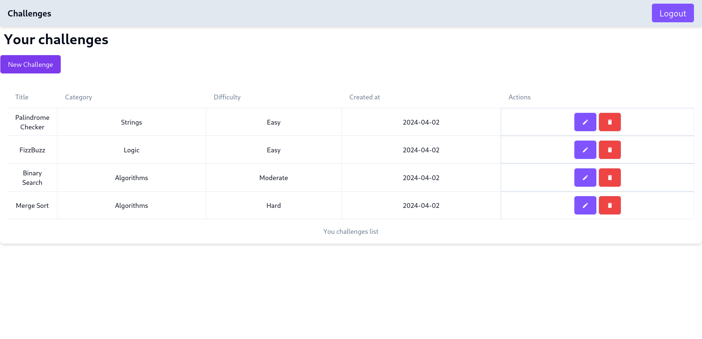
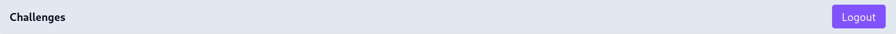
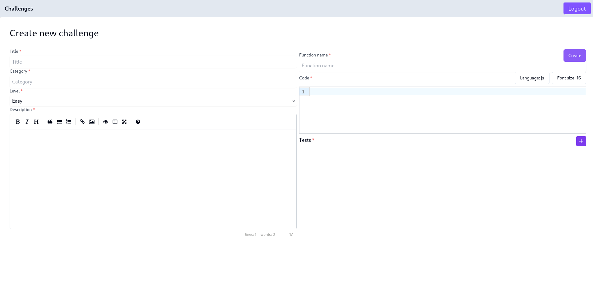
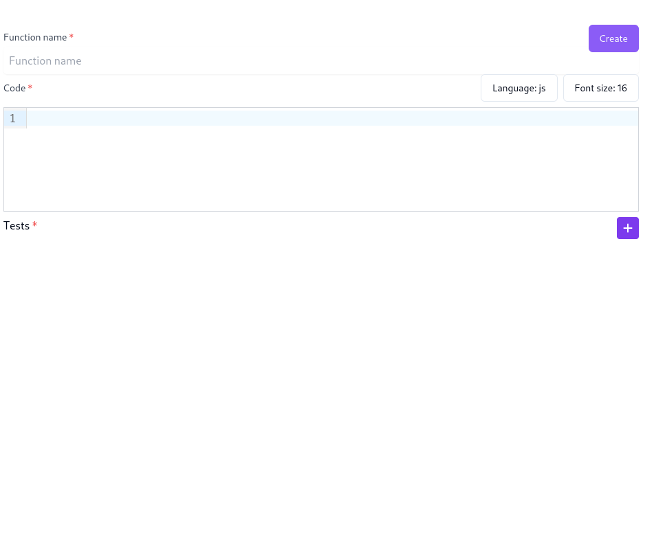
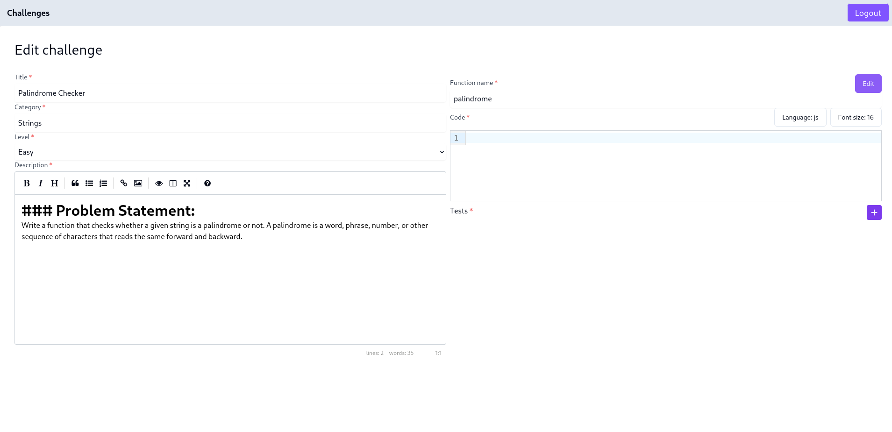

## NextJS assignment
In this assignment, you're going to build the manager dashboard app that provides utilities to create, edit, and delete challenges that will be used by coders. The app will be written in NextJS, and since you did not implement the backend app to manage the challenges (it will be implemented in a later assignment), we are going to use a simple json server that exposes CRUD endpoints for challenges.


### Project setup

#### NextJS
Before you start, make sure you create a NextJS application and configure it to run on unused port (8080 for example).

#### Json server
Next install [json-server](https://www.npmjs.com/package/json-server). It is a Node.js package that allows you to quickly set up a RESTful API with CRUD (Create, Read, Update, Delete) operations based on a JSON file. Here's the data file that we are going to use:

```json
{
  "challenges": [
    {
      "id": "1",
      "title": "Palindrome Checker",
      "category": "Strings",
      "description": "### Problem Statement:\nWrite a function that checks whether a given string is a palindrome or not. A palindrome is a word, phrase, number, or other sequence of characters that reads the same forward and backward.",
      "level": "Easy",
      "code": {},
      "tests": [],
      "createdAt": "2024-04-02"
    },
    {
      "id": "2",
      "title": "FizzBuzz",
      "category": "Logic",
      "description": "### Problem Statement:\nWrite a program that prints the numbers from 1 to 100. But for multiples of three, print 'Fizz' instead of the number, and for the multiples of five, print 'Buzz'. For numbers that are multiples of both three and five, print 'FizzBuzz'.",
      "level": "Easy",
      "code": {},
      "tests": [],
      "createdAt": "2024-04-02"
    },
    {
      "id": "3",
      "title": "Binary Search",
      "category": "Algorithms",
      "description": "### Problem Statement:\nImplement the binary search algorithm to efficiently find the position of a target value within a sorted array. The algorithm compares the target value to the middle element of the array and continues narrowing down the search until the target value is found or the search space is empty.",
      "level": "Moderate",
      "code": {},
      "tests": [],
      "createdAt": "2024-04-02"
    },
    {
      "id": "4",
      "title": "Merge Sort",
      "category": "Algorithms",
      "description": "### Problem Statement:\nImplement the merge sort algorithm to efficiently sort an array of elements. The merge sort algorithm divides the array into two halves, recursively sorts the sub-arrays, and then merges the sorted halves.",
      "level": "Hard",
      "code": {},
      "tests": [],
      "createdAt": "2024-04-02"
    }
  ]
}

```

Then run
```bash
json-server --watch db.json
```

#### Shadcn/ui
In this application, you are going to use [shadcn/ui](https://ui.shadcn.com/) design system. It's a rich  components library. It has a variety of ready, modern and customizable components React components. Please refer to the [documentation](https://ui.shadcn.com/docs) for more details of how to use it.


### 1. Authentication
You're going to develop the UI components and pages, setup redux and api for authentication.

#### a. Singin page
Here's a picture of the UI page, it's similar to the signin page of the React application.


- Develop the UI component.
- Setup routing to the signup page if the `Signup` link is clicked.
- Use [react-hook-form](https://react-hook-form.com/) and [zod](https://zod.dev/) to validate the data
    - The email should be a valid email
    - The password should be at least 6 characters long.
    - If the data is not valid, error message should appear bellow each non-valid input as shown in this picture:


#### a. Signup page
Here's a picture of the UI page, it's similar to the signup page of the React application.


- Develop the UI component
- Setup routing to the signin page if the `Signin` link is clicked.
- Use [react-hook-form](https://react-hook-form.com/) and [zod](https://zod.dev/) to validate the data
    - The first name should be a at least 2 characters long.
    - The last name should be a at least 2 characters long.
    - The email should be a valid email
    - The password should be at least 6 characters long.
    - If the data is not valid, error message should appear bellow each non-valid input. as shown here


### 2. Dashboard
The next page you are asked to develop is the dashboard page which shows a navigation bar component and a table of the created challenges
Here's the design of the home page



#### a. NavBar component
- Create a navbar component.
- It should contain a link to the home page (`Challenges`) and `Logout` button




#### b. Challenges listing component
- Create `ChallengesList` component that contains the table of challenges.
- Create an API endpoint in your nextjs api folder to get the list of all the challenges, it should invoke json-server get all challenges endpoint.
- In the challenges listing component, load the challenges and render them using [shadcn tables](https://ui.shadcn.com/docs/components/table).
- Each entry of the table contains two actions, `Edit` and `Delete`.
    - The `Edit` action is link that navigates the user to the edit challenge page.
    - The `Delete` action is a button that deletes that entry.
- In the same create `NewChallenge` link component that is when clicked, it redirects the user to the new challange that displays `ChallengeForm`

#### c. New Challenge page
Next, you're asked to develop the page that displays the `ChallengeForm` used to create a new challenge.

The page is as follows:


- Create a form that is divided into two halves, left and right.
- On the left side, we have, the `title` input, `category`, `level` which has one of the following values: `Easy`, `Moderate` or `Hard`. And the markdown previewer which is an existing react library that allows previewing markdown content, it can be found [here](https://www.npmjs.com/package/react-simplemde-editor/v/5.1.1?activeTab=readme). Install it and use, it's very simple !.

- On the right side, we have the function name of the coding challenge.
- Just bellow it the we have the code mirror that you used previously in the `Workspace` of your coder dashboard react app. You can follow the same thing.
  - Similar to the previous react application, the user can configure the language (we support `js` and `py` languages only) and the font size which should be stored in the centeralized redux state for global access.
  - For this create `LanguageMenu` and `FontSizeMenu` components to achieve this. You can make use of [shadcn dropdown components](https://ui.shadcn.com/docs/components/dropdown-menu).

>Note: For the functions, to simplify the UI and focus on the concepts, we support functions with only one argument with two types: `number` and `string`.

- After that, the user can add test cases by clicking on the plus button

  - A test case contains:
    - A `weight` which is a float number between 0 and 1 indicating the importance of the testcase.
    - A `type` which is the type of the input (`number` or `string`).
    - A `name` which is the name of the function argument.
    - A `value` which is the value of the function argument in the testcase.
    - An `output` which is the expected output of the testcase (the return value of the function).

- The user can delete the testcase by clicking on the red delete button.
- Once the user clicks on the `Create` button, the form is submitted and a post request should be sent to the `json-server` to create the challenge.
- Make sure to validate the data using react-hook-form and zod.

#### d. Edit Challenge page
When the user clicks on the edit link on the home, he gets navigated to the new challenge page.
The edit challenge page is very simple, it should make use of the same `ChallengeForm` but the form get the challenge as props and all the state is intialized with the props data as follows:



#### e. Delete challenge
When the user clicks on the `delete` button on the home page, the challenge should be deleted.
- Create an `onClick` handler for the button to delete the challenge by calling the delete api.
- Make sure to reload the data after deletion.

